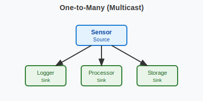
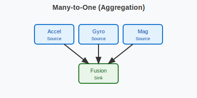

.. _flow:

Flow System
#################

The :dfn:`Flow System` is a lightweight, zero-copy packet distribution framework for Zephyr RTOS
that enables efficient many-to-many communication between threads using network buffers (:c:struct:`net_buf`).

.. contents::
    :local:
    :depth: 2

Concepts
********

The Flow system provides a high-performance mechanism for distributing network packets between
producers and consumers without data copying. Threads can send packets from sources to multiple sinks
using the underlying reference counting of network buffers, enabling true zero-copy operation.

The communication through flow is based on compile-time wiring. Sources send packets to
statically-defined sinks through connections established at build time. When a source sends a packet,
the system automatically distributes it to all connected sinks by incrementing the buffer's reference
count for each successful delivery.

.. figure:: images/flow_overview.svg
    :alt: Flow usage overview
    :width: 75%

    A typical Flow application architecture.

The system comprises:

* **Sources**: Packet producers that send network buffers to connected sinks
* **Sinks**: Packet consumers with handler callbacks that process packets immediately or via queues
* **Packet Event Queues**: Message queues that handle deferred packet processing for queued sinks
* **Connections**: Static compile-time wiring between sources and sinks
* **Packet ID Routing**: Optional packet identification and filtering for efficient routing
* **Zero-copy distribution**: Leverages :c:struct:`net_buf` reference counting to avoid data copies

.. figure:: images/flow_anatomy.svg
    :alt: Flow anatomy
    :width: 70%

    Flow system anatomy.

Key Design Principles
=====================

Zero-Copy Operation
-------------------

The Flow system achieves zero-copy by using the reference counting mechanism of Zephyr's
:c:struct:`net_buf`. When sending a packet to multiple sinks:

1. The source calls :c:func:`flow_source_send` or :c:func:`flow_source_send_consume` with a network buffer
2. For each sink, the buffer's reference count is incremented
3. Each sink's handler receives a borrowed (non-owned) reference to the buffer
4. The framework automatically releases the reference after the handler completes - handlers must NOT call unref

This eliminates memory copies entirely, making it ideal for high-throughput packet processing.
The ``send_consume`` variant is more convenient when the caller is done with the buffer,
as it transfers ownership to the framework instead of keeping a reference.

Connection Wiring
-----------------

Connections between sources and sinks can be established both at compile time and runtime.
**Compile-time wiring is the recommended approach** for most use cases.

**Compile-Time Wiring** (recommended):

Using macros that leverage Zephyr's iterable sections provides:

* **No runtime overhead**: Connections are resolved at link time
* **Memory efficiency**: No dynamic allocation needed
* **Type safety**: Connections verified at compile time
* **Predictable behavior**: System topology known at build time

**Runtime Wiring** (for dynamic scenarios):

The framework also supports runtime connections for cases requiring dynamic topology changes,
though this comes with additional overhead and complexity.

Many-to-Many Communication
--------------------------

The system supports flexible topologies:

* A source can connect to multiple sinks (multicast/broadcast)
* A sink can receive from multiple sources (aggregation)
* Each connection is independent and isolated

    One-to-Many (Multicast) - One source distributes to multiple sinks.

    Many-to-One (Aggregation) - Multiple sources feed into one sink.

Packet Distribution Process
===========================

When a source sends a packet, the following sequence occurs:

1. **Lock acquisition**: The source's connection list is protected by a spinlock
2. **Packet ID stamping** (if configured): Source stamps its packet ID in the buffer's user data
3. **Distribution**: For each connected sink:
   * **Packet ID filtering**: Skip sink if packet ID doesn't match sink's accept_id
   * **Immediate mode**: Handler executes immediately in source context
   * **Queued mode**: Packet event is queued for later processing
   * On success: increment buffer reference count
   * On queue failure: drop and count
4. **Lock release**: Spinlock is released
5. **Reference handling**:

   * ``flow_source_send``: Caller retains their reference
   * ``flow_source_send_consume``: Caller's reference is consumed

.. note::
   For immediate mode sinks, the handler executes in the context of the sending thread.
   Be mindful of this when sending from high-priority contexts or ISRs. Use queued mode
   sinks for deferred processing.

Usage
*****

Basic API
=========

The Flow system provides a handler-based API with flexible execution modes:

.. code-block:: c

    /* Define a packet source */
    FLOW_SOURCE_DEFINE(my_source);

    /* Handler function for processing packets */
    void my_handler(struct flow_sink *sink, struct net_buf *buf);

    /* Define immediate execution sink (runs in source context) */
    FLOW_SINK_DEFINE_IMMEDIATE(my_sink_immediate, my_handler);

    /* Define packet event queue for queued execution */
    FLOW_EVENT_QUEUE_DEFINE(my_queue, 32);  /* 32 events max */
    FLOW_SINK_DEFINE_QUEUED(my_sink_queued, my_handler,  &my_queue);

    /* Connect source to sinks at compile time */
    FLOW_CONNECT(&my_source, &my_sink_immediate);
    FLOW_CONNECT(&my_source, &my_sink_queued);

    /* Send packet at runtime */
    flow_source_send(&my_source, buf, K_NO_WAIT);           /* Preserve reference */
    flow_source_send_consume(&my_source, buf2, K_MSEC(100)); /* Consume reference */

Defining Sources and Sinks
==========================

Sources
-------

A source represents a packet producer. Define sources using :c:macro:`FLOW_SOURCE_DEFINE` or
:c:macro:`FLOW_SOURCE_DEFINE_ROUTED` for packet ID stamping:

.. code-block:: c

    #include <zephyr_io/flow/flow.h>

    /* Define buffer pool and sources */
    NET_BUF_POOL_DEFINE(sensor_pool, 10, 64, 4, NULL);

    /* Basic source - no packet ID stamping */
    FLOW_SOURCE_DEFINE(basic_source);

    /* Routed source - stamps packets with ID 0x1001 */
    FLOW_SOURCE_DEFINE_ROUTED(sensor1_source, 0x1001);
    FLOW_SOURCE_DEFINE_ROUTED(sensor2_source, 0x1002);

    void sensor_thread(void)
    {
        while (1) {
            struct net_buf *buf = net_buf_alloc(&sensor_pool, K_NO_WAIT);
            if (!buf) {
                k_sleep(K_MSEC(10));
                continue;
            }

            /* Add data to buffer */
            uint8_t *data = net_buf_add(buf, 64);
            memset(data, 0x42, 64);  /* Fill with sensor data */

            /* Send to all connected sinks - consume reference */
            /* Routed sources automatically stamp packet ID */
            flow_source_send_consume(&sensor1_source, buf, K_MSEC(100));
            /* No need to unref - send_consume handles it */

            k_sleep(K_MSEC(100));
        }
    }

Sinks
-----

A sink represents a packet consumer with a handler callback. Sinks can execute immediately
or queue packets for deferred processing.

.. important::
   Handler functions **MUST NOT** call ``net_buf_unref()`` on the received buffer.
   The handler receives a buffer it doesn't own - it's borrowed from the framework.
   The Flow framework automatically manages buffer references for all handlers,
   regardless of whether they are immediate or queued. This ensures consistent behavior
   and prevents memory leaks or double-free errors.

   If you need to chain buffers with ``net_buf_frag_add()``, you must call
   ``net_buf_ref()`` first, since the handler doesn't own the buffer it received.

**Immediate Mode Sink** (executes in source context):

.. code-block:: c

    #include <zephyr_io/flow/flow.h>

    /* Handler function */
    void logger_handler(struct flow_sink *sink, struct net_buf *buf)
    {
        LOG_INF("Received %d bytes", buf->len);
        process_packet(buf->data, buf->len);
        /* Buffer is borrowed, unref is handled automatically */
    }

    /* Define immediate sink - accepts all packet IDs */
    FLOW_SINK_DEFINE_IMMEDIATE(logger_sink, logger_handler);

    /* Define routed immediate sink - only accepts packet ID 0x1001 */
    FLOW_SINK_DEFINE_ROUTED_IMMEDIATE(sensor1_logger, logger_handler, 0x1001);

**Queued Mode Sink** (deferred processing):

.. code-block:: c

    /* Define packet event queue for deferred handling */
    FLOW_EVENT_QUEUE_DEFINE(processing_queue, 64);

    /* Define queued sink - accepts all packet IDs */
    FLOW_SINK_DEFINE_QUEUED(processor_sink, logger_handler,  &processing_queue);

    /* Define routed queued sink - only accepts packet ID 0x1002 */
    FLOW_SINK_DEFINE_ROUTED_QUEUED(sensor2_processor, logger_handler,
                                   processing_queue, 0x1002);

    /* Processing thread */
    void processor_thread(void)
    {
        while (1) {
            /* Process events from the queue */
            int ret = flow_event_process(&processing_queue, K_FOREVER);
            if (ret != 0 && ret != -EAGAIN) {
                LOG_ERR("Failed to process event: %d", ret);
            }
        }
    }

Wiring Sources and Sinks
========================

**Compile-Time Connections**

Static connections are established using :c:macro:`FLOW_CONNECT`:

.. code-block:: c

    /* Single file - direct connection */
    FLOW_SOURCE_DEFINE(my_source);
    FLOW_SINK_DEFINE_IMMEDIATE(my_sink, handler);
    FLOW_CONNECT(&my_source, &my_sink);

    /* Modular design - components define their own sources/sinks */
    /* sensor.c - Sensor module */
    FLOW_SOURCE_DEFINE(sensor_source);

    /* network.c - Network module */
    FLOW_SINK_DEFINE_QUEUED(network_sink, network_handler,  &net_queue);

    /* logger.c - Logging module */
    FLOW_SINK_DEFINE_IMMEDIATE(logger_sink, log_handler);

    /* main.c - Application wiring */
    FLOW_SOURCE_DECLARE(sensor_source);   /* From sensor.c */
    FLOW_SINK_DECLARE(network_sink);      /* From network.c */
    FLOW_SINK_DECLARE(logger_sink);       /* From logger.c */

    /* Application decides how modules connect */
    FLOW_CONNECT(&sensor_source, &network_sink);
    FLOW_CONNECT(&sensor_source, &logger_sink);

    /* Multiple connections from one source */
    FLOW_CONNECT(&sensor_source, &sink1);
    FLOW_CONNECT(&sensor_source, &sink2);
    FLOW_CONNECT(&sensor_source, &sink3);

**Runtime Connections**

Dynamic connections can be added/removed at runtime when
:kconfig:option:`CONFIG_FLOW_RUNTIME_OBSERVERS` is enabled:

.. code-block:: c

    /* Connect source and sink at runtime */
    int ret = flow_runtime_connect(&sensor_source, &debug_sink);
    if (ret == 0) {
        LOG_INF("Connected successfully");
    } else if (ret == -ENOMEM) {
        LOG_ERR("Connection pool exhausted");
    }

    /* Disconnect when no longer needed */
    flow_runtime_disconnect(&sensor_source, &debug_sink);

    /* Example: Conditional debug monitoring */
    void enable_debug_monitoring(bool enable)
    {
        if (enable) {
            flow_runtime_connect(&data_source, &debug_sink);
        } else {
            flow_runtime_disconnect(&data_source, &debug_sink);
        }
    }

.. note::
   Runtime connections are allocated from an internal pool of size
   :kconfig:option:`CONFIG_FLOW_RUNTIME_CONNECTION_POOL_SIZE` (default 16).
   The pool size should be configured based on your application's maximum
   concurrent runtime connections.

Advanced Usage
==============

Using k_poll with Packet Event Processors
------------------------------------------

Packet event queues can be integrated with :c:func:`k_poll` for efficient event-driven processing:

.. code-block:: c

    /* Define packet event queue and sinks */
    FLOW_EVENT_QUEUE_DEFINE(processing_queue, 32);

    void process_handler(struct flow_sink *sink, struct net_buf *buf)
    {
        uint32_t id = (uint32_t)sink->user_data;
        LOG_INF("Processor %d: %d bytes", id, buf->len);
        process_packet(buf);
        /* Buffer is borrowed, unref is handled automatically */
    }

    /* Multiple sinks can share the same queue */
    FLOW_SINK_DEFINE_WITH_DATA(processor1, process_handler,
                                  &processing_queue_msgq, (void *)1);
    FLOW_SINK_DEFINE_WITH_DATA(processor2, process_handler,
                                  &processing_queue_msgq, (void *)2);

    static struct k_sem shutdown_sem = Z_SEM_INITIALIZER(shutdown_sem, 0, 1);

    /* Static poll event initialization */
    static struct k_poll_event events[2] = {
        K_POLL_EVENT_STATIC_INITIALIZER(K_POLL_TYPE_MSGQ_DATA_AVAILABLE,
                                        K_POLL_MODE_NOTIFY_ONLY,
                                        &processing_queue_msgq,
                                        0),
        K_POLL_EVENT_STATIC_INITIALIZER(K_POLL_TYPE_SEM_AVAILABLE,
                                        K_POLL_MODE_NOTIFY_ONLY,
                                        &shutdown_sem,
                                        0),
    };

    void processor_thread(void)
    {

        while (1) {
            k_poll(events, ARRAY_SIZE(events), K_FOREVER);

            if (events[0].state == K_POLL_STATE_MSGQ_DATA_AVAILABLE) {
                /* Process all available events */
                while (flow_event_process(&processing_queue, K_NO_WAIT) == 0) {
                    /* Event processed by handler */
                }
                events[0].state = K_POLL_STATE_NOT_READY;
            }

            if (events[1].state == K_POLL_STATE_SEM_AVAILABLE) {
                break;  /* Shutdown */
            }
        }
    }

Packet Processing Pipeline
--------------------------

.. figure:: images/pipeline_pattern.svg
    :alt: Processing pipeline pattern
    :width: 60%

    Processing pipeline with header addition and multiple outputs.

Example showing how a processor adds headers by chaining buffers:

.. code-block:: c

    /* Processor component: receives data, adds header, forwards */
    FLOW_SINK_DEFINE_IMMEDIATE(processor_input, processor_handler);
    FLOW_SOURCE_DEFINE(processor_output);

    NET_BUF_POOL_DEFINE(header_pool, 10, 8, 4, NULL);  /* For 8-byte headers */

    void processor_handler(struct flow_sink *sink, struct net_buf *data_buf)
    {
        struct net_buf *header_buf;

        /* Allocate header buffer */
        header_buf = net_buf_alloc(&header_pool, K_NO_WAIT);
        if (!header_buf) {
            return;  /* Drop on allocation failure */
        }

        /* Add 8-byte protocol header */
        net_buf_add_le32(header_buf, 0x12345678);  /* Magic number */
        net_buf_add_le32(header_buf, data_buf->len);  /* Payload length */

        /* Chain original data after header - zero copy! */
        /* CRITICAL: Add ref before chaining since handler doesn't own data_buf
         * but net_buf_frag_add() takes ownership of the chained buffer */
        net_buf_ref(data_buf);
        net_buf_frag_add(header_buf, data_buf);

        /* Forward complete packet (header + data) */
        flow_source_send_consume(&processor_output, header_buf, K_NO_WAIT);
        /* Input buffer is borrowed, unref is handled automatically */
    }

Statistics and Monitoring
-------------------------

When :kconfig:option:`CONFIG_FLOW_STATS` is enabled, the system tracks:

.. code-block:: c

    void print_statistics(void)
    {
        uint32_t send_count, delivery_count, handled_count, dropped_count;

        /* Source statistics */
        flow_source_get_stats(&my_source, &send_count, &delivery_count);
        LOG_INF("Source statistics:");
        LOG_INF("  Messages sent: %u", send_count);
        LOG_INF("  Queued total: %u", delivery_count);

        /* Sink statistics */
        flow_sink_get_stats(&my_sink, &handled_count, &dropped_count);
        LOG_INF("Sink statistics:");
        LOG_INF("  Messages handled: %u", handled_count);
        LOG_INF("  Messages dropped: %u", dropped_count);

        /* For queued sinks, check queue status */
        if (my_queue.msgq) {
            uint32_t used = k_msgq_num_used_get(my_queue.msgq);
            uint32_t free = k_msgq_num_free_get(my_queue.msgq);
            LOG_INF("  Queue: %u used, %u free", used, free);
        }
    }

Design Patterns
***************

Sensor Data Distribution
========================

A common pattern for distributing sensor data to multiple consumers:

.. code-block:: c

    /* Handler functions */
    void fusion_handler(struct flow_sink *sink, struct net_buf *buf)
    {
        sensor_type_t type = identify_sensor(buf);
        update_fusion_state(type, buf);
        /* Buffer is borrowed, unref is handled automatically */
    }

    void logger_handler(struct flow_sink *sink, struct net_buf *buf)
    {
        log_sensor_data(buf);
        /* Buffer is borrowed, unref is handled automatically */
    }

    void network_handler(struct flow_sink *sink, struct net_buf *buf)
    {
        upload_to_cloud(buf);
        /* Buffer is borrowed, unref is handled automatically */
    }

    /* Multiple sensor sources */
    FLOW_SOURCE_DEFINE(accel_source);
    FLOW_SOURCE_DEFINE(gyro_source);
    FLOW_SOURCE_DEFINE(mag_source);

    /* Various data consumers */
    FLOW_EVENT_QUEUE_DEFINE(fusion_queue, 128);
    FLOW_SINK_DEFINE_QUEUED(fusion_sink, fusion_handler,  &fusion_queue);
    FLOW_SINK_DEFINE_IMMEDIATE(logger_sink, logger_handler);
    FLOW_EVENT_QUEUE_DEFINE(network_queue, 32);
    FLOW_SINK_DEFINE_QUEUED(network_sink, network_handler,  &network_queue);

    /* All sensors to fusion algorithm */
    FLOW_CONNECT(&accel_source, &fusion_sink);
    FLOW_CONNECT(&gyro_source, &fusion_sink);
    FLOW_CONNECT(&mag_source, &fusion_sink);

    /* All sensors to logger */
    FLOW_CONNECT(&accel_source, &logger_sink);
    FLOW_CONNECT(&gyro_source, &logger_sink);
    FLOW_CONNECT(&mag_source, &logger_sink);

    /* Only accelerometer to network (bandwidth limited) */
    FLOW_CONNECT(&accel_source, &network_sink);

Packet ID Routing Pattern
=========================

The Flow system supports efficient packet routing using packet IDs. Sources can stamp packets
with IDs, and sinks can filter to only accept specific IDs:

.. code-block:: c

    /* Define sources with packet IDs */
    FLOW_SOURCE_DEFINE_ROUTED(temperature_source, 0x0001);
    FLOW_SOURCE_DEFINE_ROUTED(humidity_source, 0x0002);
    FLOW_SOURCE_DEFINE_ROUTED(pressure_source, 0x0003);

    /* Define sinks that filter by packet ID */
    FLOW_SINK_DEFINE_ROUTED_IMMEDIATE(temp_processor, handle_temperature, 0x0001);
    FLOW_SINK_DEFINE_ROUTED_IMMEDIATE(humid_processor, handle_humidity, 0x0002);
    FLOW_SINK_DEFINE_ROUTED_IMMEDIATE(press_processor, handle_pressure, 0x0003);

    /* Universal sink that accepts all packet IDs */
    FLOW_SINK_DEFINE_IMMEDIATE(data_logger, log_all_sensors);

    /* Connect all sources to all sinks - filtering is automatic */
    FLOW_CONNECT(&temperature_source, &temp_processor);   /* Only temp packets */
    FLOW_CONNECT(&humidity_source, &humid_processor);     /* Only humidity packets */
    FLOW_CONNECT(&pressure_source, &press_processor);     /* Only pressure packets */

    /* Logger receives all packets */
    FLOW_CONNECT(&temperature_source, &data_logger);
    FLOW_CONNECT(&humidity_source, &data_logger);
    FLOW_CONNECT(&pressure_source, &data_logger);

    /* Sending automatically stamps packet ID and routes to matching sinks */
    flow_source_send(&temperature_source, temp_buf, K_NO_WAIT);
    /* Only temp_processor and data_logger receive this packet */

**Manual Packet ID Management**:

.. code-block:: c

    /* Set packet ID manually in buffer */
    flow_packet_id_set(buf, 0x1234);

    /* Get packet ID from buffer */
    uint16_t packet_id;
    if (flow_packet_id_get(buf, &packet_id) == 0) {
        LOG_INF("Packet ID: 0x%04x", packet_id);
    }

    /* FLOW_PACKET_ID_ANY (0xFFFF) is a special value */
    /* - Sources with this ID don't stamp packets */
    /* - Sinks with this ID accept all packets */
    /* - Packets with this ID are accepted by all sinks */

Router Pattern
==============

.. figure:: images/router_pattern.svg
    :alt: Router pattern
    :width: 55%

    Router pattern - distributes packets based on type.

Implementing a packet router that distributes based on packet type:

.. code-block:: c

    /* Router handler */
    void router_handler(struct flow_sink *sink, struct net_buf *buf)
    {
        /* Route based on packet type */
        switch (buf->data[0]) {
        case PROTO_TCP:
            flow_source_send(&tcp_output, buf, K_NO_WAIT);
            break;
        case PROTO_UDP:
            flow_source_send(&udp_output, buf, K_NO_WAIT);
            break;
        default:
            flow_source_send(&raw_output, buf, K_NO_WAIT);
        }
        /* Buffer is borrowed, unref is handled automatically */
    }

    /* Router with multiple outputs */
    FLOW_EVENT_QUEUE_DEFINE(router_queue, 256);
    FLOW_SINK_DEFINE_QUEUED(router_input, router_handler,  &router_queue);
    FLOW_SOURCE_DEFINE(tcp_output);
    FLOW_SOURCE_DEFINE(udp_output);
    FLOW_SOURCE_DEFINE(raw_output);

    /* Declare and connect output handlers */
    FLOW_SINK_DECLARE(tcp_handler);
    FLOW_SINK_DECLARE(udp_handler);
    FLOW_SINK_DECLARE(raw_handler);

    FLOW_CONNECT(&tcp_output, &tcp_handler);
    FLOW_CONNECT(&udp_output, &udp_handler);
    FLOW_CONNECT(&raw_output, &raw_handler);

    void router_thread(void)
    {
        int ret;

        while (1) {
            ret = flow_event_process(&router_queue, K_FOREVER);
            if (ret < 0) {
                LOG_ERR("Router processing error: %d", ret);
            }
        }
    }

Performance Considerations
**************************

Buffer Pool Management
======================

Proper buffer pool configuration is critical for performance:

.. code-block:: c

    /* Define pools for different packet sizes */
    NET_BUF_POOL_DEFINE(small_pool, 128, 64, 4, NULL);    /* Control packets */
    NET_BUF_POOL_DEFINE(medium_pool, 64, 512, 4, NULL);   /* Data packets */
    NET_BUF_POOL_DEFINE(large_pool, 16, 1500, 4, NULL);   /* Ethernet frames */
    NET_BUF_POOL_DEFINE(jumbo_pool, 4, 4096, 4, NULL);    /* Jumbo frames */

ISR Usage
=========

The Flow system can be used from ISRs with proper sink configuration:

.. code-block:: c

    /* ISR-safe handler for immediate processing */
    void event_handler(struct flow_sink *sink, struct net_buf *buf)
    {
        /* Quick processing only - defer heavy work to thread context */
        atomic_inc(&packets_received);
        /* Buffer is borrowed, unref is handled automatically */
    }

    /* Use queued sink for ISR sources to defer processing */
    FLOW_EVENT_QUEUE_DEFINE(isr_queue, 128);
    FLOW_SINK_DEFINE_QUEUED(isr_sink, process_handler,  &isr_queue);

    void my_isr(void *arg)
    {
        struct net_buf *buf = net_buf_alloc(&isr_pool, K_NO_WAIT);
        if (!buf)
            return;  /* Drop packet */

        /* Fill buffer with ISR data */
        uint8_t *data = net_buf_add(buf, 64);
        read_hardware_fifo(data, 64);

        /* Send with K_NO_WAIT in ISR context */
        flow_source_send_consume(&isr_source, buf, K_NO_WAIT);
    }

.. note::
   When sending from ISRs:

   * Always use :c:macro:`K_NO_WAIT` for send operations
   * Queued sinks automatically defer processing to thread context (ISR-safe)
   * Message queue operations (``k_msgq_put``) are ISR-safe and don't require work queues
   * Keep immediate handlers very short if used with ISR sources

Comparison with Zbus
********************

While both Flow and Zbus enable many-to-many communication, they serve different purposes:

.. list-table:: Flow vs Zbus Comparison
   :header-rows: 1
   :widths: 30 35 35

   * - Aspect
     - Flow
     - Zbus
   * - **Primary Use Case**
     - Network packet distribution
     - General message passing
   * - **Message Type**
     - Network buffers (net_buf)
     - Arbitrary C structures
   * - **Memory Model**
     - Zero-copy via reference counting
     - Copy-based with shared channel
   * - **Connection Model**
     - Static and runtime (with CONFIG_FLOW_RUNTIME_OBSERVERS)
     - Static and runtime
   * - **Observer Types**
     - Sinks with handlers (immediate/queued)
     - Listeners, subscribers, message subscribers
   * - **Synchronization**
     - Spinlock (ISR-safe)
     - Mutex with priority boost
   * - **Best For**
     - High-throughput packet streams
     - Event-driven architectures

Choose Flow when:

* Working with network buffers
* Zero-copy is critical
* High packet rates expected
* Simple producer-consumer patterns

Choose Zbus when:

* Arbitrary message types needed
* Runtime flexibility required
* Complex observer patterns
* Priority inheritance important

Configuration Options
*********************

To enable the Flow system, set :kconfig:option:`CONFIG_FLOW`.

Related configuration options:

* :kconfig:option:`CONFIG_FLOW` - Enable the Flow subsystem
* :kconfig:option:`CONFIG_FLOW_STATS` - Enable statistics tracking for sources and sinks
* :kconfig:option:`CONFIG_FLOW_NAMES` - Enable debug names for sources and sinks
* :kconfig:option:`CONFIG_FLOW_LOG_LEVEL` - Set logging level (0-4)
* :kconfig:option:`CONFIG_FLOW_INIT_PRIORITY` - System initialization priority (default 99)
* :kconfig:option:`CONFIG_FLOW_RUNTIME_OBSERVERS` - Enable runtime connections
* :kconfig:option:`CONFIG_FLOW_RUNTIME_CONNECTION_POOL_SIZE` - Size of runtime connection pool (default 16)

Required dependencies:

* :kconfig:option:`CONFIG_NET_BUF` - Network buffer support (required)

Example configuration:

.. code-block:: kconfig

    # Enable Flow with statistics and runtime connections
    CONFIG_FLOW=y
    CONFIG_FLOW_STATS=y
    CONFIG_FLOW_RUNTIME_OBSERVERS=y
    CONFIG_FLOW_RUNTIME_CONNECTION_POOL_SIZE=32  # Increase if needed
    CONFIG_FLOW_LOG_LEVEL=2

    # Required dependencies
    CONFIG_NET_BUF=y

    # Recommended for debugging
    CONFIG_LOG=y
    CONFIG_ASSERT=y
    CONFIG_FLOW_NAMES=y  # Debug names

Samples
*******

The following samples demonstrate Flow usage:

* **Basic Packet Routing** (:file:`flow/samples/basic_packet_routing`) - Shows a complete
  packet processing pipeline with header addition and multi-sink distribution

Testing
*******

The Flow system includes comprehensive test coverage:

* **Unit Tests** (:file:`flow/tests/subsys/flow/unit_test`) - API validation,
  edge cases, and reference counting verification

* **Integration Tests** (:file:`flow/tests/subsys/flow/integration`) - Large data
  transfers, streaming scenarios, and performance validation

API Reference
*************

.. doxygengroup:: flow_apis