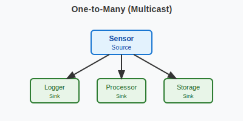
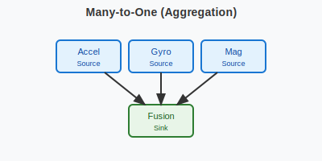
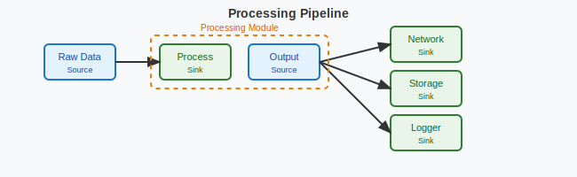

.. _packet_io:

Packet I/O System
#################

The :dfn:`Packet I/O System` is a lightweight, zero-copy packet distribution framework for Zephyr RTOS
that enables efficient many-to-many communication between threads using network buffers (:c:struct:`net_buf`).

.. contents::
    :local:
    :depth: 2

Concepts
********

The Packet I/O system provides a high-performance mechanism for distributing network packets between
producers and consumers without data copying. Threads can send packets from sources to multiple sinks
using the underlying reference counting of network buffers, enabling true zero-copy operation.

The communication through packet_io is based on compile-time wiring. Sources send packets to
statically-defined sinks through connections established at build time. When a source sends a packet,
the system automatically distributes it to all connected sinks by incrementing the buffer's reference
count for each successful delivery.

.. figure:: images/packet_io_overview.svg
    :alt: Packet I/O usage overview
    :width: 75%

    A typical Packet I/O application architecture.

The system comprises:

* **Sources**: Packet producers that send network buffers to connected sinks
* **Sinks**: Packet consumers with embedded message queues that receive packets
* **Connections**: Static compile-time wiring between sources and sinks
* **Zero-copy distribution**: Leverages :c:struct:`net_buf` reference counting to avoid data copies

.. figure:: images/packet_io_anatomy.svg
    :alt: Packet I/O anatomy
    :width: 70%

    Packet I/O system anatomy.

Key Design Principles
=====================

Zero-Copy Operation
-------------------

The Packet I/O system achieves zero-copy by using the reference counting mechanism of Zephyr's
:c:struct:`net_buf`. When sending a packet to multiple sinks:

1. The source calls :c:func:`packet_source_send` with a network buffer
2. For each successfully queued delivery, the buffer's reference count is incremented
3. Each sink receives a reference to the same buffer
4. Sinks release their reference when done processing

This eliminates memory copies entirely, making it ideal for high-throughput packet processing.

Static Compile-Time Wiring
--------------------------

All connections between sources and sinks are defined at compile time using macros that leverage
Zephyr's iterable sections. This approach provides:

* **No runtime overhead**: Connections are resolved at link time
* **Memory efficiency**: No dynamic allocation needed
* **Type safety**: Connections verified at compile time
* **Predictable behavior**: System topology known at build time

Many-to-Many Communication
--------------------------

The system supports flexible topologies:

* A source can connect to multiple sinks (multicast/broadcast)
* A sink can receive from multiple sources (aggregation)
* Each connection is independent and isolated

    One-to-Many (Multicast) - One source distributes to multiple sinks.

    Many-to-One (Aggregation) - Multiple sources feed into one sink.

Packet Distribution Process
===========================

When a source sends a packet, the following sequence occurs:

1. **Lock acquisition**: The source's connection list is protected by a spinlock
2. **Distribution**: For each connected sink:

   * Attempt non-blocking enqueue to the sink's message queue
   * On success: increment buffer reference count
   * On failure with drop_on_full: silently drop and count
   * On failure without drop_on_full: return error

3. **Lock release**: Spinlock is released
4. **Caller retains reference**: The caller keeps their original reference

.. note::
   The distribution happens in the context of the sending thread. Be mindful of
   this when sending from high-priority contexts or ISRs.

Usage
*****

Basic API
=========

The Packet I/O system provides a simple API with four main macros:

.. code-block:: c

    /* Define a packet source */
    PACKET_SOURCE_DEFINE(my_source);

    /* Define a packet sink with queue size and drop policy */
    PACKET_SINK_DEFINE(my_sink, 32, true);  /* 32 entries, drop on full */

    /* Connect source to sink at compile time */
    PACKET_SOURCE_CONNECT(my_source, my_sink);

    /* Send packet at runtime (does NOT consume reference) */
    int delivered = packet_source_send(&my_source, buf);

Defining Sources and Sinks
==========================

Sources
-------

A source represents a packet producer. Define sources using :c:macro:`PACKET_SOURCE_DEFINE`:

.. code-block:: c

    #include <zephyr/packet_io/packet_io.h>

    /* Define buffer pool and source */
    NET_BUF_POOL_DEFINE(sensor_pool, 10, 64, 4, NULL);
    PACKET_SOURCE_DEFINE(sensor_source);

    void sensor_thread(void)
    {
        while (1) {
            struct net_buf *buf = net_buf_alloc(&sensor_pool, K_NO_WAIT);
            if (!buf) {
                k_sleep(K_MSEC(10));
                continue;
            }

            /* Add data to buffer */
            uint8_t *data = net_buf_add(buf, 64);
            memset(data, 0x42, 64);  /* Fill with sensor data */

            /* Send to all connected sinks */
            packet_source_send(&sensor_source, buf);

            /* Release our reference */
            net_buf_unref(buf);

            k_sleep(K_MSEC(100));
        }
    }

Sinks
-----

A sink represents a packet consumer with an embedded message queue. Define sinks using
:c:macro:`PACKET_SINK_DEFINE`:

.. code-block:: c

    #include <zephyr/packet_io/packet_io.h>

    /* Define sink: 64 queue entries, drop packets if full */
    PACKET_SINK_DEFINE(logger_sink, 64, true);

    void logger_thread(void)
    {
        struct net_buf *buf;

        while (1) {
            /* Receive packet pointer from queue */
            if (k_msgq_get(&logger_sink.msgq, &buf, K_FOREVER) == 0) {
                LOG_INF("Received %d bytes", buf->len);

                /* Process packet data */
                process_packet(buf->data, buf->len);

                /* Release our reference */
                net_buf_unref(buf);
            }
        }
    }

Wiring Sources and Sinks
========================

Connections between sources and sinks are established at compile time using
:c:macro:`PACKET_SOURCE_CONNECT`:

.. code-block:: c

    #include <zephyr/packet_io/packet_io.h>

    /* Define components */
    NET_BUF_POOL_DEFINE(data_pool, 10, 64, 4, NULL);
    PACKET_SOURCE_DEFINE(sensor_source);
    PACKET_SINK_DEFINE(processor_sink, 32, false);  /* Don't drop */
    PACKET_SINK_DEFINE(logger_sink, 64, true);      /* Drop if full */

    /* Wire connections - one source to multiple sinks */
    PACKET_SOURCE_CONNECT(sensor_source, processor_sink);
    PACKET_SOURCE_CONNECT(sensor_source, logger_sink);

    /* Producer thread */
    void producer_thread(void)
    {
        while (1) {
            struct net_buf *buf = net_buf_alloc(&data_pool, K_NO_WAIT);
            if (buf) {
                /* Fill buffer with data */
                uint8_t *data = net_buf_add(buf, 64);
                generate_data(data, 64);

                /* Send to all connected sinks */
                packet_source_send(&sensor_source, buf);
                net_buf_unref(buf);
            }
            k_sleep(K_MSEC(100));
        }
    }

    /* Consumer threads read from their respective queues */
    void processor_thread(void)
    {
        struct net_buf *buf;
        while (k_msgq_get(&processor_sink.msgq, &buf, K_FOREVER) == 0) {
            process_data(buf->data, buf->len);
            net_buf_unref(buf);
        }
    }

Advanced Usage
==============

Using k_poll with Sinks
-----------------------

Sinks can be integrated with :c:func:`k_poll` for efficient event-driven processing:

.. code-block:: c

    PACKET_SINK_DEFINE(processor_sink, 32, false);
    static struct k_sem shutdown_sem;

    void processor_thread(void)
    {
        struct net_buf *buf;
        struct k_poll_event events[2];

        k_sem_init(&shutdown_sem, 0, 1);

        k_poll_event_init(&events[0],
                          K_POLL_TYPE_MSGQ_DATA_AVAILABLE,
                          K_POLL_MODE_NOTIFY_ONLY,
                          &processor_sink.msgq);

        k_poll_event_init(&events[1],
                          K_POLL_TYPE_SEM_AVAILABLE,
                          K_POLL_MODE_NOTIFY_ONLY,
                          &shutdown_sem);

        while (1) {
            k_poll(events, ARRAY_SIZE(events), K_FOREVER);

            if (events[0].state == K_POLL_STATE_MSGQ_DATA_AVAILABLE) {
                while (k_msgq_get(&processor_sink.msgq, &buf, K_NO_WAIT) == 0) {
                    process_packet(buf);
                    net_buf_unref(buf);
                }
                events[0].state = K_POLL_STATE_NOT_READY;
            }

            if (events[1].state == K_POLL_STATE_SEM_AVAILABLE) {
                break;  /* Shutdown */
            }
        }
    }

Packet Processing Pipeline
--------------------------

    Processing pipeline with header addition and multiple outputs.

Here's an example of a packet processing pipeline with header addition:

.. code-block:: c

    /* Protocol header */
    struct protocol_header {
        uint8_t source_id;
        uint16_t sequence;
        uint32_t timestamp;
    } __packed;

    /* Buffer pools */
    NET_BUF_POOL_DEFINE(raw_pool, 20, 256, 4, NULL);
    NET_BUF_POOL_DEFINE(processed_pool, 20,
                        sizeof(struct protocol_header) + 256, 4, NULL);

    /* Pipeline components */
    PACKET_SOURCE_DEFINE(raw_source);
    PACKET_SINK_DEFINE(processor_input, 128, true);
    PACKET_SOURCE_DEFINE(processor_output);
    PACKET_SINK_DEFINE(network_sink, 32, false);
    PACKET_SINK_DEFINE(storage_sink, 64, true);

    /* Wire the pipeline */
    PACKET_SOURCE_CONNECT(raw_source, processor_input);
    PACKET_SOURCE_CONNECT(processor_output, network_sink);
    PACKET_SOURCE_CONNECT(processor_output, storage_sink);

    /* Processing thread adds header */
    void processor_thread(void)
    {
        struct net_buf *in_buf, *out_buf;
        uint16_t sequence = 0;

        while (1) {
            if (k_msgq_get(&processor_input.msgq, &in_buf, K_FOREVER) != 0)
                continue;

            out_buf = net_buf_alloc(&processed_pool, K_NO_WAIT);
            if (!out_buf) {
                net_buf_unref(in_buf);
                continue;
            }

            /* Add header */
            struct protocol_header *hdr = net_buf_add(out_buf, sizeof(*hdr));
            hdr->source_id = 0x42;
            hdr->sequence = sequence++;
            hdr->timestamp = k_uptime_get_32();

            /* Copy original data */
            net_buf_add_mem(out_buf, in_buf->data, in_buf->len);

            /* Forward to outputs */
            packet_source_send(&processor_output, out_buf);

            net_buf_unref(out_buf);
            net_buf_unref(in_buf);
        }
    }

Statistics and Monitoring
-------------------------

When :kconfig:option:`CONFIG_PACKET_IO_STATS` is enabled, the system tracks:

.. code-block:: c

    void print_statistics(void)
    {
        LOG_INF("Source statistics:");
        LOG_INF("  Messages sent: %u", atomic_get(&my_source.msg_count));

        LOG_INF("Sink statistics:");
        LOG_INF("  Messages received: %u", atomic_get(&my_sink.received_count));
        LOG_INF("  Messages dropped: %u", atomic_get(&my_sink.dropped_count));

        /* Check queue status */
        uint32_t used = k_msgq_num_used_get(&my_sink.msgq);
        uint32_t free = k_msgq_num_free_get(&my_sink.msgq);
        LOG_INF("  Queue: %u used, %u free", used, free);
    }

Design Patterns
***************

Sensor Data Distribution
========================

A common pattern for distributing sensor data to multiple consumers:

.. code-block:: c

    /* Multiple sensor sources */
    PACKET_SOURCE_DEFINE(accel_source);
    PACKET_SOURCE_DEFINE(gyro_source);
    PACKET_SOURCE_DEFINE(mag_source);

    /* Various data consumers */
    PACKET_SINK_DEFINE(fusion_sink, 128, true);    /* Sensor fusion */
    PACKET_SINK_DEFINE(logger_sink, 256, true);    /* Data logging */
    PACKET_SINK_DEFINE(network_sink, 32, false);   /* Cloud upload */

    /* All sensors to fusion algorithm */
    PACKET_SOURCE_CONNECT(accel_source, fusion_sink);
    PACKET_SOURCE_CONNECT(gyro_source, fusion_sink);
    PACKET_SOURCE_CONNECT(mag_source, fusion_sink);

    /* All sensors to logger */
    PACKET_SOURCE_CONNECT(accel_source, logger_sink);
    PACKET_SOURCE_CONNECT(gyro_source, logger_sink);
    PACKET_SOURCE_CONNECT(mag_source, logger_sink);

    /* Only accelerometer to network (bandwidth limited) */
    PACKET_SOURCE_CONNECT(accel_source, network_sink);

Router Pattern
==============

.. figure:: images/router_pattern.svg
    :alt: Router pattern
    :width: 55%

    Router pattern - distributes packets based on type.

Implementing a packet router that distributes based on packet type:

.. code-block:: c

    /* Router with multiple outputs */
    PACKET_SINK_DEFINE(router_input, 256, false);
    PACKET_SOURCE_DEFINE(tcp_output);
    PACKET_SOURCE_DEFINE(udp_output);
    PACKET_SOURCE_DEFINE(raw_output);

    /* Connect outputs to handlers */
    PACKET_SOURCE_CONNECT(tcp_output, tcp_handler);
    PACKET_SOURCE_CONNECT(udp_output, udp_handler);
    PACKET_SOURCE_CONNECT(raw_output, raw_handler);

    void router_thread(void)
    {
        struct net_buf *buf;

        while (1) {
            if (k_msgq_get(&router_input.msgq, &buf, K_FOREVER) != 0)
                continue;

            /* Route based on packet type */
            switch (buf->data[0]) {
            case PROTO_TCP:
                packet_source_send(&tcp_output, buf);
                break;
            case PROTO_UDP:
                packet_source_send(&udp_output, buf);
                break;
            default:
                packet_source_send(&raw_output, buf);
            }

            net_buf_unref(buf);
        }
    }

Performance Considerations
**************************

Buffer Pool Management
======================

Proper buffer pool configuration is critical for performance:

.. code-block:: c

    /* Define pools for different packet sizes */
    NET_BUF_POOL_DEFINE(small_pool, 128, 64, 4, NULL);    /* Control packets */
    NET_BUF_POOL_DEFINE(medium_pool, 64, 512, 4, NULL);   /* Data packets */
    NET_BUF_POOL_DEFINE(large_pool, 16, 1500, 4, NULL);   /* Ethernet frames */
    NET_BUF_POOL_DEFINE(jumbo_pool, 4, 4096, 4, NULL);    /* Jumbo frames */

Queue Sizing
============

Size sink queues based on expected traffic patterns:

* **High-frequency sources**: Use larger queues to handle bursts
* **Drop-sensitive data**: Set ``drop_on_full`` to false and size appropriately
* **Best-effort data**: Set ``drop_on_full`` to true for overflow handling

.. code-block:: c

    /* Critical data - never drop, large queue */
    PACKET_SINK_DEFINE(critical_sink, 256, false);

    /* Telemetry - can drop old data, moderate queue */
    PACKET_SINK_DEFINE(telemetry_sink, 64, true);

    /* Debug output - best effort, small queue */
    PACKET_SINK_DEFINE(debug_sink, 16, true);

ISR Usage
=========

The Packet I/O system can be used from ISRs:

.. code-block:: c

    void my_isr(void *arg)
    {
        struct net_buf *buf = net_buf_alloc(&isr_pool, K_NO_WAIT);
        if (!buf)
            return;  /* Drop packet */

        /* Fill buffer with ISR data */
        uint8_t *data = net_buf_add(buf, 64);
        read_hardware_fifo(data, 64);

        /* Send with K_NO_WAIT in ISR context */
        packet_source_send(&isr_source, buf);
        net_buf_unref(buf);
    }

.. warning::
   When sending from ISRs, always use :c:macro:`K_NO_WAIT` and be aware that
   the distribution happens in ISR context.

Comparison with Zbus
********************

While both Packet I/O and Zbus enable many-to-many communication, they serve different purposes:

.. list-table:: Packet I/O vs Zbus Comparison
   :header-rows: 1
   :widths: 30 35 35

   * - Aspect
     - Packet I/O
     - Zbus
   * - **Primary Use Case**
     - Network packet distribution
     - General message passing
   * - **Message Type**
     - Network buffers (net_buf)
     - Arbitrary C structures
   * - **Memory Model**
     - Zero-copy via reference counting
     - Copy-based with shared channel
   * - **Connection Model**
     - Static compile-time only
     - Static and runtime
   * - **Observer Types**
     - Sinks with queues
     - Listeners, subscribers, message subscribers
   * - **Synchronization**
     - Spinlock (ISR-safe)
     - Mutex with priority boost
   * - **Best For**
     - High-throughput packet streams
     - Event-driven architectures

Choose Packet I/O when:

* Working with network buffers
* Zero-copy is critical
* High packet rates expected
* Simple producer-consumer patterns

Choose Zbus when:

* Arbitrary message types needed
* Runtime flexibility required
* Complex observer patterns
* Priority inheritance important

Configuration Options
*********************

To enable the Packet I/O system, set :kconfig:option:`CONFIG_PACKET_IO`.

Related configuration options:

* :kconfig:option:`CONFIG_PACKET_IO` - Enable the Packet I/O subsystem
* :kconfig:option:`CONFIG_PACKET_IO_STATS` - Enable statistics tracking for sources and sinks
* :kconfig:option:`CONFIG_PACKET_IO_LOG_LEVEL` - Set logging level (0-4)
* :kconfig:option:`CONFIG_PACKET_IO_PRIORITY` - System initialization priority (default 99)

Required dependencies:

* :kconfig:option:`CONFIG_NET_BUF` - Network buffer support (required)

Example configuration:

.. code-block:: kconfig

    # Enable Packet I/O with statistics
    CONFIG_PACKET_IO=y
    CONFIG_PACKET_IO_STATS=y
    CONFIG_PACKET_IO_LOG_LEVEL=2

    # Required dependencies
    CONFIG_NET_BUF=y

    # Recommended for debugging
    CONFIG_LOG=y
    CONFIG_ASSERT=y

Samples
*******

The following samples demonstrate Packet I/O usage:

* **Basic Packet Routing** (:file:`packet_io/samples/basic_packet_routing`) - Shows a complete
  packet processing pipeline with header addition and multi-sink distribution

Testing
*******

The Packet I/O system includes comprehensive test coverage:

* **Unit Tests** (:file:`packet_io/tests/subsys/packet_io/unit_test`) - API validation,
  edge cases, and reference counting verification

* **Integration Tests** (:file:`packet_io/tests/subsys/packet_io/integration`) - Large data
  transfers, streaming scenarios, and performance validation

Run tests using:

.. code-block:: bash

    # Run all tests with Twister
    PYTHON_PREFER=$PWD/.venv/bin/python3 CMAKE_PREFIX_PATH=$PWD/.venv \
      .venv/bin/python zephyr/scripts/twister \
      -T packet_io/tests -p native_sim -v

API Reference
*************

.. doxygengroup:: packet_io_apis